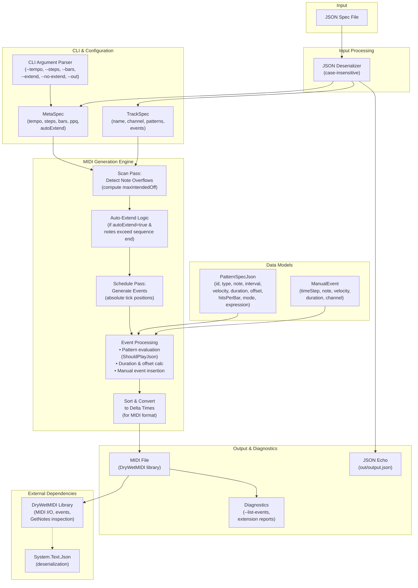

# Parametric MIDI Sequencer Architecture

## System Overview

This document describes the high-level architecture of the Parametric MIDI Sequencer, a JSON-driven tool for generating MIDI sequences from parameterized patterns.



## Key Components

### 1. **Input Layer**
- **JSON Spec Files**: The only input format, with flexible structure:
  - Full spec: `{ meta: {...}, tracks: [...] }`
  - Or just tracks array: `[{ name: "...", patterns: [...] }, ...]`

### 2. **CLI & Configuration**
- **CliParser** (`Program.cs`): Extracts flags (tempo, steps, bars, extend, no-extend, list-events, out)
- **MetaSpec**: Holds global properties (tempo, steps, bars, ppq, autoExtend)
- **TrackSpec**: Defines a MIDI track with patterns and/or manual events

### 3. **Data Models**
- **PatternSpecJson**: Rich pattern definition with:
  - `Duration` (in steps, can be fractional)
  - `Offset` (fractional step offset)
  - `Velocity`, `Channel`
  - `HitsPerBar`, `Mode` (for bar-relative scheduling)
  - `Expression` (for function-based patterns like `sin(x) > 0.5`)
- **ManualEvent**: Direct note insertion at specific steps

### 4. **MIDI Generation Engine** (`MidiGenerator.cs`)
Single entry point: `GenerateFromSpec(MetaSpec, TrackSpec[])`

**Two-pass scheduling**:
1. **Scan Pass**: Evaluate all patterns and events, detect if notes overflow sequence end
2. **Auto-Extend** (if enabled): Extends bars (and meta.Bars) to accommodate overflowing notes; warns if disabled
3. **Schedule Pass**: Re-evaluate using extended bars; compute absolute ticks for all events

**Event Processing**:
- Pattern evaluation: `ShouldPlayJson()` checks modulo intervals, function expressions, bar-relative hits
- Duration & offset calculation (handles fractional offsets → ticks)
- Manual events inserted at specified steps

**Sort & Convert**: Events sorted by time (meta first, NoteOff before NoteOn), converted to delta times for MIDI format

Returns final bars used

### 5. **Output & Diagnostics**
- **MIDI File**: Written via DryWetMIDI; includes TimeSignatureEvent (4/4) and SetTempoEvent
- **JSON Echo**: Pretty-printed input spec saved to `out/output.json`
- **Diagnostics**:
  - `--list-events`: Prints note schedule with start times, durations, velocities
  - Auto-extend reports: "Extended bars by N to allow notes to finish"
  - Overflow warnings: "notes overflow the sequence end ... Set autoExtend=true or increase bars"

### 6. **External Dependencies**
- **DryWetMIDI**: MIDI event types, file I/O, GetNotes() for inspection
- **System.Text.Json**: Case-insensitive deserialization for flexible JSON input

## Data Flow Example: JSON → MIDI

```
examples/patterns3.json
  ↓ (JsonDeserializer, case-insensitive)
MetaSpec { tempo: 100, steps: 16, bars: 8, autoExtend: true }
TrackSpec[] { Patterns: [K, S], Events: [] }
  ↓ (CliParser override: --extend / --no-extend)
MetaSpec.AutoExtend ← CLI override (if provided)
  ↓ (GenerateFromSpec)
  ├─ Scan: maxIntendedOff = 15360 ticks
  ├─ Auto-Extend: 15360 >= 15360 → extend by 1 bar → bars = 9
  ├─ Schedule: evaluate K (interval 8), S (interval 8, offset 4)
  │  at steps 0-143 (9 bars × 16 steps)
  │  both with duration 4 steps = 480 ticks
  ├─ Sort: meta events (tempo, time sig) first; then NoteOn/NoteOff by time
  └─ Convert: delta times, write MIDI
  ↓
out/test_json_only.mid (MIDI file with 34 notes, 9 bars)
out/output.json (echo of input spec)
```

## Scheduling Algorithm

### Tick Calculation
```
ticksPerStep = PPQ × 4 / Steps
totalSteps = Steps × Bars
maxSequenceTime = totalSteps × ticksPerStep

For each pattern:
  noteOnTime = (stepIndex × ticksPerStep) + (offset × ticksPerStep)
  noteOffTime = noteOnTime + (duration × ticksPerStep)
```

### Pattern Evaluation
- **Modulo**: `play if (step % interval == 0)` (global or bar-relative via HitsPerBar)
- **Function**: `play if (expression(step, totalSteps) == true)` e.g., `sin(x) > 0.5`

### Auto-Extension
- If `autoExtend=true` and any note's intended off exceeds sequence end:
  - Calculate extra bars needed
  - Ensure final note ends strictly before new end (no end-time tie)
  - Re-evaluate schedule with extended bars
  - Report: "Extended bars by N to allow notes to finish"

## Future Enhancements

- [ ] Unit tests for scheduling (fractional offsets, clamping, triplet grids)
- [ ] Additional pattern types (e.g., probability, stochastic)
- [ ] Per-track velocty/channel overrides
- [ ] Graphical editor for pattern composition
- [ ] Support for other time signatures (not just 4/4)
- [ ] Swing and shuffle timing options
